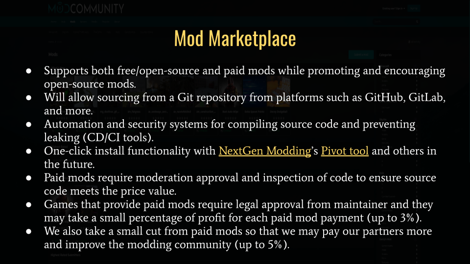
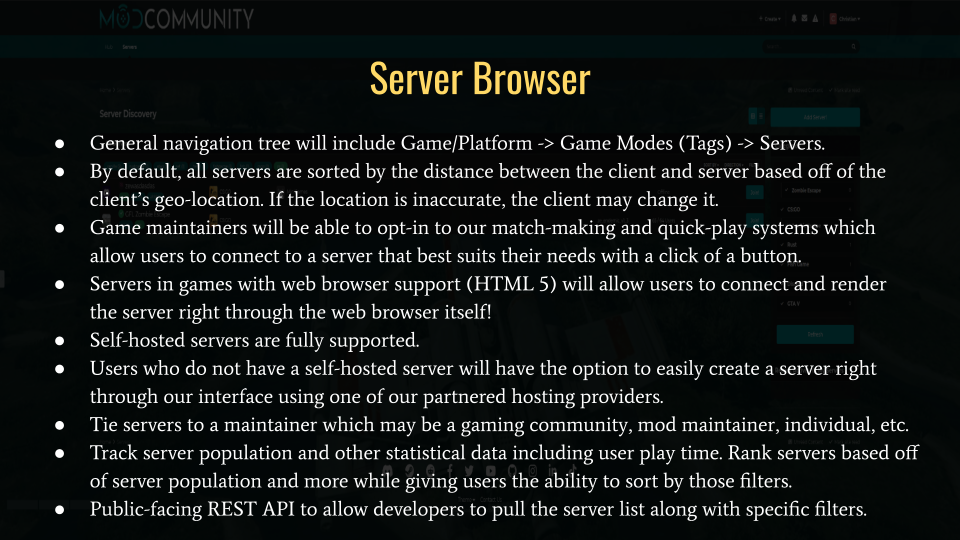
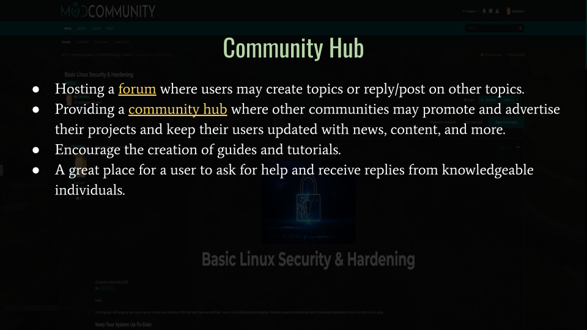

# Road Map
You may find road maps for our various services [here](https://github.com/modcommunity/roadmap/projects)!

## [Mod Marketplace](https://github.com/orgs/modcommunity/projects/1)

## [Server Browser](https://github.com/orgs/modcommunity/projects/2)

## [Community Hub](https://github.com/orgs/modcommunity/projects/3)
## [Forums](https://github.com/orgs/modcommunity/projects/4)

## [Platinum](https://github.com/orgs/modcommunity/projects/5)
Platinum (name change TBD) will act as a community suite and implement all of our current services into their own application instead of relying on [Invision Power Services](https://invisionpower.com/), which is what we're using for at this moment.

Reasons for moving away from IPS 4 include.

* IPS 4 is very feature-rich, but also very bloated which can confuse new users.
* IPS 4 doesn't officially support our web server and only supports Apache.
* IPS 4's team is primarily focusing on their cloud hosting services rather than self-hosted services.

IPS 4 was always going to be temporary, but allows us to prototype our services. Additionally, [Best Mods](https://bestmods.io/), [Gamecom](https://gamecom.io/), and [Best Servers](https://bestservers.io) will be using open source and modern technology that we will use for Platinum in the future.

## [Home Page](https://github.com/orgs/modcommunity/projects/6)
Our home page will break down important parts of our presentation from [here](https://docs.google.com/presentation/d/e/2PACX-1vSlROYETsWYlJkqM7y9J5qeHRjh6ZY6Liv0RIkxSX6EjQ7X3_kzQFkp3HNHtebks8YAe3e2QV2lBmka/pub?slide=id.p).

## [About And Documentation](https://github.com/orgs/modcommunity/projects/7)
Our about section will break down our entire presentation from [here](https://docs.google.com/presentation/d/e/2PACX-1vSlROYETsWYlJkqM7y9J5qeHRjh6ZY6Liv0RIkxSX6EjQ7X3_kzQFkp3HNHtebks8YAe3e2QV2lBmka/pub?slide=id.p). We will also focus on our mission and goals.

Documentation includes how our services work, frequently asked questions, and more.
